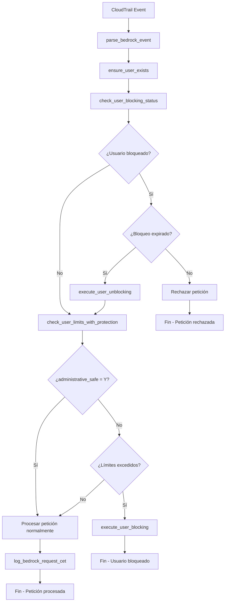
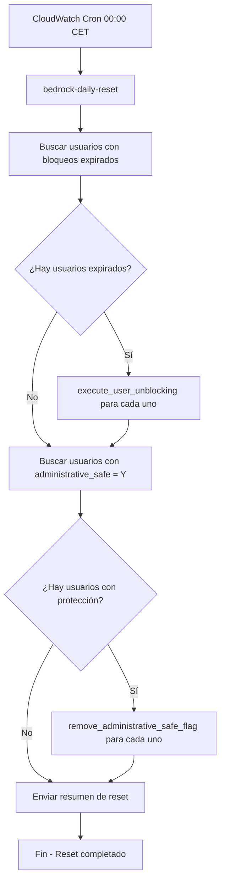

# Documentación: Lógica de Bloqueos y Desbloqueos - AWS Bedrock Usage Control

## 📋 Resumen Ejecutivo

Este documento describe la lógica completa del sistema de control de uso de AWS Bedrock, incluyendo todos los procesos de bloqueo y desbloqueo tanto automáticos como manuales, así como las dependencias críticas de los campos `administrative_safe` y `blocked_until`.

## 🏗️ Arquitectura del Sistema

### Funciones Lambda Principales

1. **`bedrock-realtime-usage-controller`** - Función principal que maneja:
   - Procesamiento de eventos CloudTrail (bloqueos automáticos)
   - Operaciones manuales desde dashboard (API events)
   - Desbloqueos automáticos por expiración

2. **`bedrock-daily-reset`** - Función de reset diario que:
   - Desbloquea usuarios con bloqueos expirados
   - Remueve flags `administrative_safe`
   - Ejecuta limpieza diaria del sistema

3. **`bedrock-email-service`** - Servicio de notificaciones que:
   - Envía emails de bloqueo/desbloqueo
   - Maneja diferentes tipos de notificaciones
   - Soporte para operaciones manuales y automáticas

## 🔄 Flujos de Bloqueo y Desbloqueo

### 1. BLOQUEO AUTOMÁTICO (Por Límites de Uso)

#### Desencadenante:
- **Evento CloudTrail** de uso de Bedrock procesado por `bedrock-realtime-usage-controller`

#### Flujo de Ejecución:
```
1. CloudTrail Event → Lambda Function
2. parse_bedrock_event() → Extrae datos del usuario
3. ensure_user_exists() → Verifica/crea usuario en BD
4. check_user_blocking_status() → ¿Usuario bloqueado?
   ├─ SI: Verificar expiración → execute_user_unblocking() si expiró
   └─ NO: Continuar
5. check_user_limits_with_protection() → ¿Debe bloquearse?
   ├─ administrative_safe = 'Y' → NO BLOQUEAR (return False)
   └─ administrative_safe = 'N' → Verificar límites
6. Si debe bloquearse → execute_user_blocking()
7. Si no → log_bedrock_request_cet()
```

#### Función: `execute_user_blocking()`
```python
def execute_user_blocking(connection, user_id: str, block_reason: str, usage_info: Dict[str, Any]) -> bool:
    # 1. Actualizar USER_BLOCKING_STATUS
    blocked_until = (current_time + 1 day).replace(hour=0, minute=0, second=0)
    
    # 2. Registrar en BLOCKING_AUDIT_LOG
    
    # 3. Crear política IAM de DENY
    implement_iam_blocking(user_id)
    
    # 4. Enviar email de notificación
    send_blocking_email_gmail()
```

#### Dependencias Críticas:
- **`administrative_safe`**: Si es `'Y'`, **NO se ejecuta bloqueo automático**
- **`blocked_until`**: Se establece a las 00:00 CET del día siguiente
- **Límites**: `daily_request_limit` y `monthly_request_limit` de tabla `user_limits`

### 2. DESBLOQUEO AUTOMÁTICO (Por Expiración)

#### Desencadenante:
- **Evento CloudTrail** procesado cuando usuario bloqueado hace petición
- **Función de reset diario** ejecutada por CloudWatch Events

#### Flujo de Ejecución:
```
1. check_user_blocking_status() ejecutado SIEMPRE
2. Consultar USER_BLOCKING_STATUS donde user_id = X
3. Si is_blocked = 'Y' AND blocked_until <= current_time:
   └─ execute_user_unblocking()
4. Si no está bloqueado o no ha expirado:
   └─ Continuar con lógica normal
```

#### Función: `execute_user_unblocking()`
```python
def execute_user_unblocking(connection, user_id: str) -> bool:
    # 1. Actualizar USER_BLOCKING_STATUS
    SET is_blocked = 'N', blocked_until = NULL
    
    # 2. Registrar en BLOCKING_AUDIT_LOG
    
    # 3. Remover política IAM de DENY
    implement_iam_unblocking(user_id)
    
    # 4. Enviar email de notificación
    send_unblocking_email_gmail()
```

#### Dependencias Críticas:
- **`blocked_until`**: Comparado con tiempo actual CET
- **`is_blocked`**: Debe ser `'Y'` para ejecutar desbloqueo
- **Timezone**: Todas las comparaciones en CET (Europe/Madrid)

### 3. BLOQUEO MANUAL (Dashboard/Admin)

#### Desencadenante:
- **API Event** con `action: 'block'` desde dashboard

#### Flujo de Ejecución:
```
1. handle_api_event() → Detecta action = 'block'
2. manual_block_user() → Procesa bloqueo manual
3. get_user_current_usage() → Obtiene uso actual
4. execute_admin_blocking() → Ejecuta bloqueo administrativo
```

#### Función: `execute_admin_blocking()`
```python
def execute_admin_blocking(connection, user_id: str, reason: str, performed_by: str, usage_info: Dict[str, Any]) -> bool:
    # DIFERENCIA CLAVE: Bloqueo por 24 horas, no hasta medianoche
    blocked_until = current_time + timedelta(hours=24)
    
    # 1. Actualizar USER_BLOCKING_STATUS
    # 2. Registrar en BLOCKING_AUDIT_LOG con performed_by
    # 3. Crear política IAM de DENY
    # 4. Enviar email administrativo
```

#### Dependencias Críticas:
- **`blocked_until`**: Se establece a +24 horas desde el momento actual
- **`performed_by`**: Se registra quién ejecutó el bloqueo
- **`administrative_safe`**: NO afecta a bloqueos manuales

### 4. DESBLOQUEO MANUAL (Dashboard/Admin)

#### Desencadenante:
- **API Event** con `action: 'unblock'` desde dashboard

#### Flujo de Ejecución:
```
1. handle_api_event() → Detecta action = 'unblock'
2. manual_unblock_user() → Procesa desbloqueo manual
3. execute_admin_unblocking() → Ejecuta desbloqueo administrativo
```

#### Función: `execute_admin_unblocking()`
```python
def execute_admin_unblocking(connection, user_id: str, reason: str, performed_by: str) -> bool:
    # 1. Actualizar USER_BLOCKING_STATUS
    SET is_blocked = 'N', blocked_until = NULL
    
    # 2. ACTIVAR PROTECCIÓN ADMINISTRATIVA
    UPDATE user_limits SET administrative_safe = 'Y'
    
    # 3. Registrar en BLOCKING_AUDIT_LOG
    # 4. Remover política IAM de DENY
    # 5. Enviar email administrativo
```

#### Dependencias Críticas:
- **`administrative_safe`**: Se establece a `'Y'` para prevenir re-bloqueos automáticos
- **`performed_by`**: Se registra quién ejecutó el desbloqueo
- **Protección temporal**: Previene bloqueos automáticos hasta el reset diario

### 5. RESET DIARIO (Función Programada)

#### Desencadenante:
- **CloudWatch Events** cron schedule a las 00:00 CET diariamente

#### Flujo de Ejecución:
```
1. unblock_all_blocked_users_and_notify()
2. Buscar usuarios con blocked_until <= current_time
3. Para cada usuario expirado:
   └─ execute_user_unblocking()
4. Buscar usuarios activos con administrative_safe = 'Y'
5. Para cada usuario con protección:
   └─ remove_administrative_safe_flag()
```

#### Función: `remove_administrative_safe_flag()`
```python
def remove_administrative_safe_flag(connection, user_id: str) -> bool:
    # Remover protección administrativa diaria
    UPDATE user_limits SET administrative_safe = 'N'
    
    # Registrar operación en audit log
    INSERT INTO blocking_audit_log (operation_type = 'ADMIN_SAFE_REMOVED')
```

#### Dependencias Críticas:
- **`blocked_until`**: Usuarios con fecha <= tiempo actual son desbloqueados
- **`administrative_safe`**: Se remueve de TODOS los usuarios activos
- **Programación**: Ejecutado diariamente a las 00:00 CET

## 🔑 Campos Críticos y Sus Dependencias

### Campo: `administrative_safe`

#### Propósito:
Proteger usuarios contra bloqueos automáticos temporalmente.

#### Estados y Comportamientos:

| Estado | Comportamiento | Cuándo se establece | Cuándo se remueve |
|--------|----------------|-------------------|-------------------|
| `'Y'` | **NO se ejecutan bloqueos automáticos** | - Desbloqueo manual por admin<br>- Usuario con protección especial | - Reset diario (00:00 CET)<br>- Usuario es desbloqueado por expiración |
| `'N'` | **Se ejecutan bloqueos automáticos normalmente** | - Usuario nuevo<br>- Después del reset diario | - Al establecer protección administrativa |

#### Flujo de Verificación:
```python
def check_user_limits_with_protection(connection, user_id: str):
    # CRÍTICO: Esta verificación ocurre DESPUÉS de check_user_blocking_status
    if administrative_safe == 'Y':
        return False, None, usage_info  # NO BLOQUEAR
    
    # Solo si administrative_safe = 'N' se verifican límites
    if daily_usage >= daily_limit:
        return True, "Daily limit exceeded", usage_info  # BLOQUEAR
```

#### ⚠️ **BUG CORREGIDO**: 
Anteriormente, si `administrative_safe = 'Y'`, la función retornaba inmediatamente sin ejecutar `check_user_blocking_status`, impidiendo desbloqueos automáticos por expiración.

### Campo: `blocked_until`

#### Propósito:
Definir cuándo expira un bloqueo para desbloqueo automático.

#### Formatos y Comportamientos:

| Tipo de Bloqueo | Valor de `blocked_until` | Lógica de Expiración |
|-----------------|-------------------------|---------------------|
| **Automático** | `YYYY-MM-DD 00:00:00` (medianoche siguiente) | Expira a las 00:00 CET del día siguiente |
| **Manual** | `YYYY-MM-DD HH:MM:SS` (+24h desde bloqueo) | Expira exactamente 24h después del bloqueo |
| **Indefinido** | `NULL` o fecha muy futura | No expira automáticamente |

#### Verificación de Expiración:
```python
def check_user_blocking_status(connection, user_id: str):
    if blocked_until:
        current_cet_time = get_current_cet_time()
        if blocked_until.tzinfo is None:
            blocked_until = CET.localize(blocked_until)
        
        if current_cet_time >= blocked_until:
            execute_user_unblocking(connection, user_id)  # DESBLOQUEAR
            return False, None
```

#### Timezone Handling:
- **Todas las fechas en CET** (Europe/Madrid)
- **Manejo de DST** automático con pytz
- **Comparaciones** siempre en timezone-aware datetime

## 🔄 Matriz de Interacciones

### Interacción: `administrative_safe` vs `blocked_until`

| Escenario | `administrative_safe` | `blocked_until` | Resultado |
|-----------|----------------------|-----------------|-----------|
| Usuario normal bloqueado | `'N'` | Fecha futura | ✅ Se desbloquea al expirar |
| Usuario con protección bloqueado | `'Y'` | Fecha futura | ✅ Se desbloquea al expirar (después del fix) |
| Usuario normal activo | `'N'` | `NULL` | ✅ Puede ser bloqueado automáticamente |
| Usuario con protección activo | `'Y'` | `NULL` | ❌ NO puede ser bloqueado automáticamente |

### Interacción: Bloqueo Manual vs Automático

| Tipo | Ejecutor | `blocked_until` | `administrative_safe` después |
|------|----------|-----------------|------------------------------|
| **Automático** | `'system'` | Medianoche siguiente | Sin cambios |
| **Manual Block** | `'admin'` | +24 horas | Sin cambios |
| **Manual Unblock** | `'admin'` | `NULL` | Se establece a `'Y'` |

## 📊 Diagramas de Flujo

### Flujo Principal de Procesamiento de Eventos



### Flujo de Reset Diario



## 🛠️ Operaciones IAM

### Bloqueo IAM (`implement_iam_blocking`)

```json
{
  "Version": "2012-10-17",
  "Statement": [
    {
      "Sid": "DailyLimitBlock",
      "Effect": "Deny",
      "Action": [
        "bedrock:InvokeModel",
        "bedrock:InvokeModelWithResponseStream",
        "bedrock:Converse",
        "bedrock:ConverseStream"
      ],
      "Resource": "*"
    },
    {
      "Sid": "BedrockAccess",
      "Effect": "Allow",
      "Action": [
        "bedrock:InvokeModel",
        "bedrock:InvokeModelWithResponseStream",
        "bedrock:Converse",
        "bedrock:ConverseStream"
      ],
      "Resource": "*"
    }
  ]
}
```

### Desbloqueo IAM (`implement_iam_unblocking`)

```json
{
  "Version": "2012-10-17",
  "Statement": [
    {
      "Sid": "BedrockAccess",
      "Effect": "Allow",
      "Action": [
        "bedrock:InvokeModel",
        "bedrock:InvokeModelWithResponseStream",
        "bedrock:Converse",
        "bedrock:ConverseStream"
      ],
      "Resource": "*"
    }
  ]
}
```

**Nota**: El statement de "Deny" se remueve completamente durante el desbloqueo.

## 📧 Sistema de Notificaciones

### Tipos de Email por Operación

| Operación | Función Email | Color | Contenido |
|-----------|---------------|-------|-----------|
| **Bloqueo Automático** | `send_blocking_email_gmail` | 🔴 Rojo claro | Límites excedidos, expira a medianoche |
| **Desbloqueo Automático** | `send_unblocking_email_gmail` | 🟢 Verde | Acceso restaurado automáticamente |
| **Bloqueo Manual** | `send_enhanced_blocking_email` | 🔴 Rojo claro | Bloqueado por admin, expira en 24h |
| **Desbloqueo Manual** | `send_enhanced_unblocking_email` | 🟢 Verde | Desbloqueado por admin + protección |
| **Reset Diario** | `send_reset_email_notification` | 🟢 Verde | Reset diario completado |

### Integración con Email Service

```python
# Bloqueo automático
send_blocking_email_gmail(user_id, reason, usage_info, blocked_until)

# Bloqueo manual
send_enhanced_blocking_email(user_id, reason, usage_info, performed_by)

# Desbloqueo automático  
send_unblocking_email_gmail(user_id)

# Desbloqueo manual
send_enhanced_unblocking_email(user_id, reason, performed_by)
```

## 🔍 Casos de Uso Específicos

### Caso 1: Usuario Excede Límite Diario
```
1. Usuario hace petición #351 (límite: 350)
2. check_user_limits_with_protection() → should_block = True
3. execute_user_blocking() → blocked_until = mañana 00:00 CET
4. IAM policy → Deny statement añadido
5. Email enviado → "Límite diario excedido"
```

### Caso 2: Admin Desbloquea Usuario Manualmente
```
1. Admin ejecuta unblock desde dashboard
2. execute_admin_unblocking() → is_blocked = 'N'
3. administrative_safe = 'Y' → Protección activada
4. IAM policy → Deny statement removido
5. Email enviado → "Desbloqueado por administrador"
```

### Caso 3: Usuario con Protección Hace Petición
```
1. Usuario con administrative_safe = 'Y' hace petición
2. check_user_blocking_status() → Verifica expiración primero
3. check_user_limits_with_protection() → return False (no bloquear)
4. log_bedrock_request_cet() → Petición procesada normalmente
```

### Caso 4: Reset Diario a las 00:00 CET
```
1. CloudWatch trigger → bedrock-daily-reset
2. Buscar usuarios con blocked_until <= now()
3. execute_user_unblocking() para cada usuario expirado
4. remove_administrative_safe_flag() para usuarios activos
5. Enviar resumen por email
```

## ⚠️ Consideraciones Importantes

### Timezone Handling
- **Todas las operaciones en CET** (Europe/Madrid)
- **DST automático** con pytz
- **Comparaciones timezone-aware** obligatorias

### Orden de Ejecución Crítico
1. **SIEMPRE** verificar `check_user_blocking_status` primero
2. **DESPUÉS** verificar `check_user_limits_with_protection`
3. **NUNCA** saltarse la verificación de expiración

### Protección Administrativa
- **Se activa** automáticamente en desbloqueos manuales
- **Se remueve** diariamente a las 00:00 CET
- **Previene** bloqueos automáticos, NO manuales

### Auditoría Completa
- **Todas las operaciones** se registran en `blocking_audit_log`
- **Incluye** performed_by, timestamps, y razones
- **Permite** trazabilidad completa de acciones

## 🚀 Conclusiones

El sistema de control de uso de AWS Bedrock implementa una lógica robusta y completa que:

1. **Protege** contra uso excesivo con bloqueos automáticos
2. **Permite** intervención administrativa cuando es necesaria
3. **Mantiene** trazabilidad completa de todas las operaciones
4. **Respeta** timezones y horarios de negocio (CET)
5. **Notifica** a usuarios de todos los cambios de estado

Los campos `administrative_safe` y `blocked_until` son fundamentales para el correcto funcionamiento del sistema y deben ser manejados con cuidado en cualquier modificación futura.
